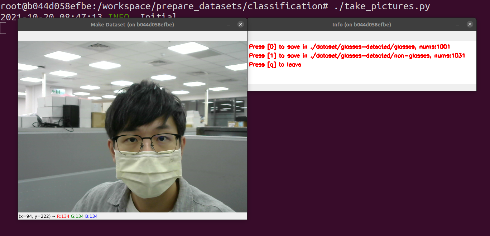
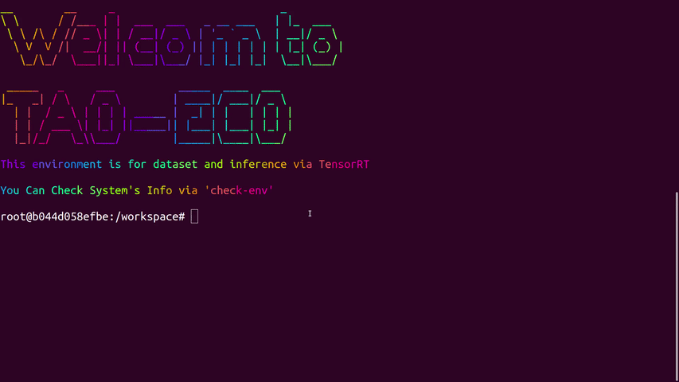
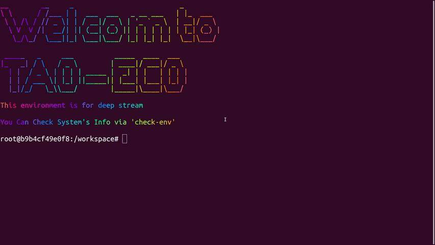
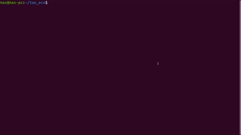

# TAO-ECO

* Build Environments for Inference (`TensorRT`, `DeepStream`) & Convert `etlt` model
    
    * docker
        * [Dockerfile](./docker/Dockerfile) : build Docker image and container
        * [requirements.sh](./docker/requirements.sh): install requirement when building the target docker image.
        
* Make A Custom Dataset
    
    * prepare_datasets/{tasks}
        > tasks=classfication:

        * [dataset.json](./training_tools/make_datasets/classification/dataset.json): steup classes and dataset's root before you collect data.
        * [take_pictures.py](./training_tools/make_datasets/classification/take_pictures.py): execute it to collect data
        * [format_dataset.py](./training_tools/make_datasets/classification/format_dataset.py): split datasets into `split/` using `-s` and `--sroot`
    * 
* Train with TAO Toolkit

# How to use?

## Prepare Dataset for TAO Toolkit
> only support classification now

1. Build Environment

    ```bash
    ./run_tao

    task=classification
    cd /workspace/prepare_datasets/${task}/
    ```
    

2. Modify `dataset.json` before collect
    * path : path of dataset
    * classes : name of classes

    ```json
    {
        "path":"./dataset/glasses-detected",
        "classes":[
            "glasses",
            "non-glasses"
        ]
    }
    ```

3. Take Picture to Make A Custom Dataset

    ```bash
    ./take_pictures.py
    ```
    


3. Split Custom Dataset

    ```bash
    ./format_dataset.py -s --sroot dataset/glasses-detected/

    INFO:root:Initialize ... 
    INFO:root:Update split folder ... 
    INFO:root:Create directory (./split/train)
    INFO:root:Create directory (./split/test)
    INFO:root:Create directory (./split/val)
    INFO:root:Split custom data is starting
    100%|######| 2/2 [00:00<00:00,  8.47it/s]
    INFO:root:Split data finished
    INFO:root:Found 1421 data in ./split/train
    INFO:root:Found 203 data in ./split/val
    INFO:root:Found 408 data in ./split/test
    INFO:root:All Done.
    ```

## Do Inference via TensorRT

1. Build Environment

    ```bash
    ./run_tao

    task=glasses
    cd tensorrt/tasks/
    ```
    

2. Put `etlt` model into tensorrt/tasks/{your task's name}/

    ```bash
    # 1: Create Folder
    mkdir ${task} && cd ${task}
    
    # 2: Put model & classmap into ${task}
    
    # 3: Check
    ls ${task}
    glasses_detector_prune_e020.etlt

    ```

3. Convert `etlt` model to `TensorRT`

    ```bash
    # 1. Setup model name which is same with etlt model
    MODEL_NAME=glasses_detector_prune_e020
    cd /workspace/tensorrt/etlt_to_tensorrt

    # 2. Convert to TensorRT Engine
    ./classification_converter.sh ../tasks/glasses/${MODEL_NAME}.etlt ../task/glasses/${MODEL_NAME}.trt

    ```
    

4. Inference via TensorRT

    ```bash
    cd /workspace/tensorrt/inference
    ./trt_infer.py ../tasks/glasses/*trt /dev/video0 ../tasks/glasses/*json

    ```
    

## Do inference via Deep Stream

1. Build & Run Environment

    ```bash
    ./run_eco ds
    ```

    

    Using Check-Tools
        You can use `check-info` to check information of system:
        ```
        check-info
        ```
        

2. Create Model's Config - `config_infer_secondary_glasses.txt`

    ```text
    [property]
    gpu-id=0
    net-scale-factor=1.0
    offsets=103.939;116.779;123.68
    model-color-format=1
    batch-size=4
    tlt-model-key=nvidia_tlt
    tlt-encoded-model=../models/custom/glasses/glasses_detector_prune_e020.etlt
    labelfile-path=labels_glasses.txt
    model-engine-file=../models/custom/glasses/glasses_detector_prune_e020.etlt_b1_gpu0_fp32.engine
    infer-dims=3;224;224
    uff-input-blob-name=input_1
    uff-input-order=0
    output-blob-names=predictions/Softmax
    process-mode=2
    model-color-format=0
    ## 0=FP32, 1=INT8, 2=FP16 mode
    network-mode=0
    network-type=1 
    interval=0
    num-detected-classes=2
    interval=0
    gie-unique-id=3

    ```

3. Create Deepstream-App's Config - `deepstream_app_s1_mask_glasses.txt`
    
    I use two classifier ( detect glasses and mask ) in my case.
    ```text
    [secondary-gie0]
    enable=1
    model-engine-file=../models/custom/mask/mask_detector_prune_e020.etlt_b1_gpu0_fp32.engine
    gpu-id=0
    batch-size=1
    gie-unique-id=2
    operate-on-gie-id=1
    operate-on-class-ids=0;
    config-file=config_infer_secondary_mask.txt

    [secondary-gie1]
    enable=1
    model-engine-file=../models/custom/glasses/glasses_detector_prune_e020.etlt_b1_gpu0_fp32.engine
    gpu-id=0
    batch-size=1
    gie-unique-id=3
    operate-on-gie-id=1
    operate-on-class-ids=0;
    config-file=config_infer_secondary_glasses.txt

    ```

4. Run Deep Stream

    ```bash
    # deepstream-app -c path/to/deepstream-app

    deepstream-app -c deepstream_app_s1_mask_glasses.txt
    ```
    
    


## Remove TAO-ECO

```bash
./rm_eco
```



---


---
